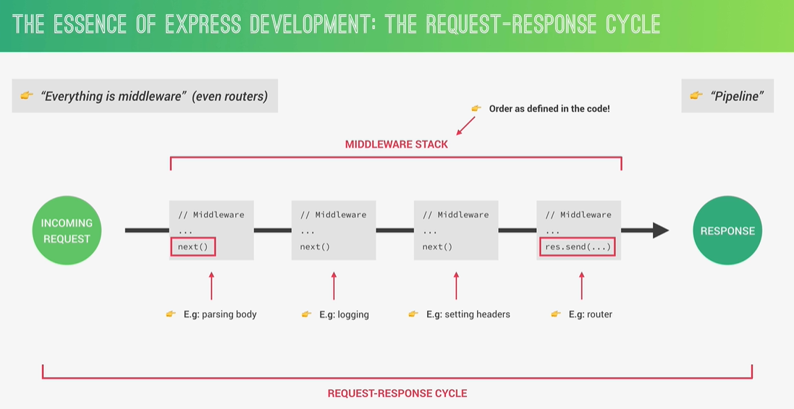

## Express

Express is a minimal NodeJS framework, a higher level of abstraction.
Express contains a very robust set of features: complex routing, easier handling of requests and responses, middleware, server-side rendering, etc.
Express allows for rapid development of NodeJS applications: we don't have to reinvent the wheel.
Express make it easier to organize our application into MVC architecture.

## API

Rest Architecture:

Put - Need to pass whole object to be updated
Patch - Can pass just updated part of the object to be updated

## JSON

Each key_name should be a string, but key_value can be any data type like string, number, boolean, array or any other object.
Enveloping while sending it into response:
{
"status": "success",
"statusCode": 200,
"data": data_object
}

Stateless RESTful API:
All state should be handled on the client. Each request must contain all the information necessary to process a certain request. The server should not have to remember the previous requests.

## Status codes

200 - OK
201 - Created
404 - Resource not found
500 - Server error
204 - Content not [the server has successfully fulfilled the request and there is no additional information to send back.]
400 - Bad request

## Responding to url parameters

app.get('/api/v1/tours/:id/:x/:y?', (req, res) => {
res.status(200).json({
status: 'success',
});
});
where ? is used to make the parameter y optional

## Request Response Cycle

middleware is the code that intercepts req and res. Order of the middleware matters a lot. We must use next() function to call next middleware, req res cycle will get stuck. The last middleware sends response back to the client using res.end()
e.g.
app.use(express.json());
app.use is used to use middleware

Own middleware:
app.use((req, res, next) => {
console.log('Hello from middleware...');
next();
});
app.use((req, res, next) => {
req.reqTime = new Date().toISOString();
next();
});
const getAllTours = (req, res) => {
res.status(200).json({
status: 'success',
requestedTime: req.reqTime,
results: tours.length,
data: {
tours,
},
});
};

## morgon package

It is request logger middleware
npm i morgon
const morgon = require('morgon')
app.use(morgan('dev'));

output:
GET /api/v1/tours 200 3.522 ms - 8751
GET /api/v1/tours/59 404 1.489 ms - 44

## Reference

https://expressjs.com/en/4x/api.html

## Info

The == operator does the type conversion of the operands before comparison, whereas the === operator compares the values as well as the data types of the operands.

## Setting virtuals

tourSchema.virtual('durationWeeks').get(function () {
return this.duration / 7;
});

adding it in schema -
{
toJSON: { virtuals: true },
toObject: { virtuals: true },
}

We can't query on virtuals because it doesn't present in the database.

## Built-In validators

required
maxlength - on string
minlength - on string
min - on number, date
max - on number, date
enum - allowed values

Check documentation for more validators. We can also match the values with regex.
Set updateValidators as true in updateRequest in Tour Controller.

## Custom validators

Here 'this' refers to the new document which get created, it will not work for update

priceDiscount: {
type: Number,
validate: {
validator: function (val) {
return val < this.price;
},
message: 'Discount price ({VALUE}) should be below regular price.',
},
},

We can use libraries like 'validator' to validate data.
